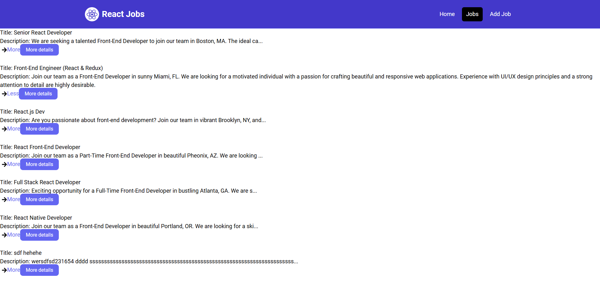

# Welcome to my Git repo of ReactJs learning (React + Vite + TailWind CSS + JsonServer+...)

**Disclaimer:** this is a mini project that help me to learn ReactJs, it does not suppose to be a proper application with good UI and stuff. Its main purpose is for exploring how to work with ReactJs as much as I can.  
Original tutorial is from [TraversyMedia](https://www.youtube.com/watch?v=LDB4uaJ87e0&ab_channel=TraversyMedia) YouTube channel  

  
  
  
## The crash course given below knowledge:
* React component
* export/import components
* import json file content
* Nesting components
* Setup React Router/Routes
* Setup Common Layout for Routes
* usage of Props (properties that can be passed in/used within a component)
* useState (including state name, set state method and default value of the state. When a state changed, the component is refreshed)
* common syntax in React/JavaScript
* useEffect (code under useEffect will be run on every single change of the browser. It can be limited to only run the code when some variables are updated by listing the names in the dependency array)
* setup proxy, setup mock json-server as backend and perform fetching data from frontend (mock API routes will be based on the highest object's key name of the json file)
* useParams (get path params from the frontend api route)
* use 'useLoaderData' for decoupling requests to backend APIs
* implement CRUD services from frontend and use react-toastify to show result notifications
* build production code of the react-app and run the production version

## Setup and install dependencies
- Follow steps in the "Install Tailwind CSS with Vite - Tailwind CSS".html file (same location of this note) for setting up React project using Vite and Tailwind CSS
 - npm install react-icons (to use fontAwesome - Fa)
- npm install react-router-dom (to use React routes for multiple pages instead of 1 page)
- npm install -D json-server (mockup backend server so that frontend can build API request and return without a backend server)
- npm install react-spinners (spinning icons)
- npm install react-toastify (show floating notification)	 


## Essential Commands:
### To run application in dev mode
```npm run dev```

### To run json-server as a mock backend server
```npm run server```

### To build production code for this app (a dist folder will be created once done)
```npm run build```

### To run production version of this app
```npm run preview```

## Additional learning notes: 
- The app start from index.html file which call the React JavaScript file using script tag > the JS then will render the React components and assign to the "root" id element defined in the html file.
 
- StrictMode tag is a wrapper component to check if there is potential problems in your app (deprecated, unsafe life cycle methods, legacy context API usage, etc.)
- NavLink is same as Link element but support more features such as "isActive" property to check if current uri is the loaded one or not.


## This template provides a minimal setup to get React working in Vite with HMR and some ESLint rules.

Currently, two official plugins are available:

- [@vitejs/plugin-react](https://github.com/vitejs/vite-plugin-react/blob/main/packages/plugin-react/README.md) uses [Babel](https://babeljs.io/) for Fast Refresh
- [@vitejs/plugin-react-swc](https://github.com/vitejs/vite-plugin-react-swc) uses [SWC](https://swc.rs/) for Fast Refresh
